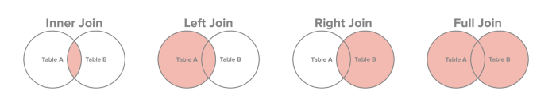
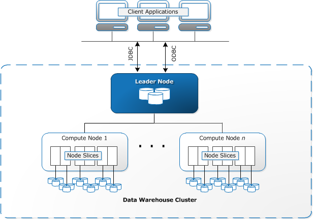
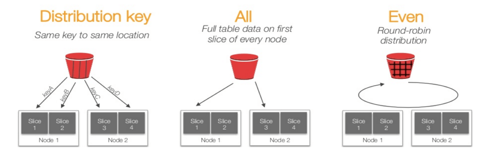

# Banco de dados

Os bancos de dados fizeram com que o armazenamento das informações fosse mais adequado. 

## Modelagem Relacional x Modelagem Dimensional

Na **modelagem relacional**, é necessário que os dados estejam normalizados, reduzindo a redundância de dados e as chances de inconsistência. Para isto, eles devem obedecer algumas regras, sendo as principais a Primeira, Segunda e Terceira Formas Normais (1FN, 2FN, 3FN). De maneira sucinta, temos que:

**1FN**: 
  - Atributos monovalorados;
  - Atributos atômicos (indivisíveis);
  - Não pode ter tabelas aninhadas (ocultas).

**2FN**: 
  - Atributo não-chave (atributo primo) dependem totalmente da chave toda;
  - Dependência funcional da chave inteira.

**3FN**: 
  -  Dependência direta da chave;
  - Atributo primo não depende de outro atributo primo;
  - Eliminar campos calculáveis;
  - Eliminar campos que podem ser obtidos a partir de outros.


Esse estilo de banco tem como foco inserir, alterar e deletar os dados e podemos destacar alguns bancos como MySQL, PostgreSQL, MS SQL e Oracle. Armazenam as informações linearmente. 

As consultas feitas em bancos de dados totalmente normalizados têm um mau desempenho, então para melhor desempenho nas consultas, é preferível utilizar a **modelagem dimensional** - que possui os dados desnormalizados. Com ela, não temos a garantia de consistências dos dados, além de termos um banco muito maior, em contrapartida, é um sistema informacional, ou seja, poderá ter redundância de dados, mas será mais rápido.

Também são chamados de bancos de dados colunares, uma vez que a informação é armazenada coluna a coluna e alguns exemplos são o Amazon Redshift e o Google BigQuery.

### SQL

A linguagem de consulta SQL, (sigla do inglês _Structured Query Language_), é usada para executar comandos em bancos de dados relacionais. 

Podemos destacar quatro instruções:

- **DQL _(Data Query Language)_** - Define o comando utilizado para que possamos consultar (```SELECT```) os dados armazenados no banco;
- **DML _(Data Manipulation Language)_** - Define os comandos utilizados para manipulação de dados no banco (```INSERT```, ```UPDATE``` e ```DELETE```);
- **DDL _(Data Definition Language)_** - Define os comandos utilizados para criação (```CREATE```) de tabelas, views, índices, atualização dessas estruturas (```ALTER```), assim como a remoção (```DROP```);
- **DCL _(Data Control Language)_** - Define os comandos utilizados para controlar o acesso aos dados do banco, adicionando (```GRANT```) e removendo (```REVOKE```) permissões de acesso.

Para as ```queries``` vale destacar o uso dos ```joins```, sendo os quatro mais básicos apresentados na imagem:



### Redshift

O Redshift é um serviço de armazenamento de dados gerenciado em nuvem.

Para criar um data warehouse, deve-se lançar um conjunto de nós chamados de clusters e, após carregar o conjunto de dados, é possível realizar consultas utilizando as mesmas ferramentas baseadas em SQL.

A arquitetura do Redshift é massivamente paralela, isto é, uma arquitetura distribuída em que há um nó líder que interage com várias ferramentas (como SQL, BI, código etc). O nó líder cria um plano para que os nós de computação executem as ações (queries, filtros etc) e devolvam o resultado para o nó líder, que por sua vez, retorna para a ferramenta utilizada. A imagem abaixo mostra essa arquitetura.



Com essa arquitetura, o Redshift permite que os usuários gerenciem prioridades de maneira flexível dentro de cargas de trabalho, de modo que consultas curtas e rápidas não fiquem presas atrás de consultas demoradas, este serviço se chama Amazon Redshift workload management (WLM). Algumas boas práticas são a compressão de tabelas e a distrubuição de dados.

Comprimir dados ajuda o Cluster a ler os dados de maneira mais rápida, otimizando o _storage_ e a performance.

Para isto, existem comandos de compressão que podem ser encontrados na documentação. Para verificar se a coluna está comprimida, faz-se:

```
SELECT “column”, type, encoding FROM pg_table_def WHERE tablename = “deep_dive”;
```

Como a arquitetura é distribuída, o dado também fica armazenado de maneira distribuída. No Redshift existem quatro tipos de métodos de distribuição:

- _**Distribution Style All**_: todos os nós tem uma cópia da tabela. Indicado para tabelas pequenas.
- _**Distribution Style Even**_: a distribuição é feita de maneira igual para todos os nós. Indicado para tabelas que não participam de Joins.
- _**Distribution Key**_: utiliza-se uma coluna para distribuir os dados. É importante levar alguns pontos para defini-la: alta cardinalidade, frequentemente usada em joins e também com os dados uniformes em tamanho.
- _**Distribuition Auto**_: combina o EVEN e o ALL.




## Funções analíticas (Window functions)

As _window functions_ ou funções de janela possibilitam a criação de consultas de forma mais eficiente. Neste contexto, a janela se refere a um conjunto de linhas cujo conteúdo é definido na cláusula ```OVER```. Sua sintaxe básica é dada por:

```
OVER (   
      [ <PARTITION BY clause> ]  
      [ <ORDER BY clause> ]   
      [ <ROW or RANGE clause> ]  
     )
```

em que os três elementos possibilitam o particionamento (```PARTITION BY```), ordenação (```ORDER BY```) e _framing_ (```ROW``` ou ```RANGE```) do conteúdo da janela.

## Referências

- [Data Warehouse – Modelagem Dimensional](https://web.archive.org/web/20210502224033/https://rafaelpiton.com.br/blog/data-warehouse-modelagem-dimensional/)

- [Normalização de Bancos de Dados Relacionais](http://www.dsc.ufcg.edu.br/~pet/jornal/maio2011/materias/recapitulando.html)

- [Normalização](https://web.archive.org/web/20210502224311/https://sites.google.com/site/fkbancodedados1/normalizacao)

- [INNER, CROSS, LEFT, RIGHT E FULL JOINS](https://web.archive.org/web/20210502223348/https://www.devmedia.com.br/inner-cross-left-rigth-e-full-joins/21016)

- [Qual é a diferença entre INNER JOIN e OUTER JOIN?](https://web.archive.org/web/20210502223801/https://pt.stackoverflow.com/questions/6441/qual-%C3%A9-a-diferen%C3%A7a-entre-inner-join-e-outer-join)

- [MySQL JOINs](https://medium.com/@ram.avni/mysql-joins-110bb151d689)

- [O que é um banco de dados colunar](https://web.archive.org/web/20210503000558/https://kondado.com.br/blog/blog/2019/10/31/o-que-e-um-banco-de-dados-colunar/)

- [What is Amazon Redshift?](https://docs.aws.amazon.com/pt_br/redshift/latest/mgmt/welcome.html)

- [Arquitetura de sistema do data warehouse](https://docs.aws.amazon.com/pt_br/redshift/latest/dg/c_high_level_system_architecture.html)

- [Workload management](https://docs.aws.amazon.com/redshift/latest/dg/c_workload_mngmt_classification.html)

- [Como conseguimos reduzir nosso cluster de Redshift e aumentar a performance?](https://movile.blog/como-conseguimos-reduzir-nosso-cluster-de-redshift-e-aumentar-a-performance/)

- [Analise todos os seus dados](https://aws.amazon.com/pt/redshift/?whats-new-cards.sort-by=item.additionalFields.postDateTime&whats-new-cards.sort-order=desc)

- [Window functions](https://docs.aws.amazon.com/pt_br/redshift/latest/dg/c_Window_functions.html)

- [Funções de janela (window functions)](https://web.archive.org/web/20210503011800/https://portosql.wordpress.com/2018/10/14/funcoes-de-janela-window-functions/)
