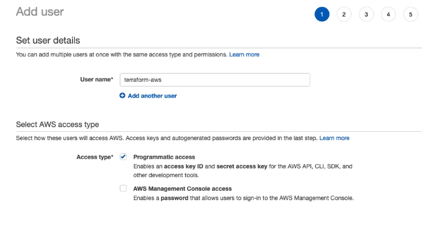

# Terraform

O Terraform é uma ferramenta para auxiliar a criar, administrar, tomar conta da infraestrutura de um jeito simples.

## Instalação

## Conexão com o provedor

Para fazer a gestão do ambiente, é necessário criar um usuário no provedor para conectar e dar acesso.

### AWS

IAM > Users > Add users 

https://www.terraform.io/cdktf/concepts/providers-and-resources
